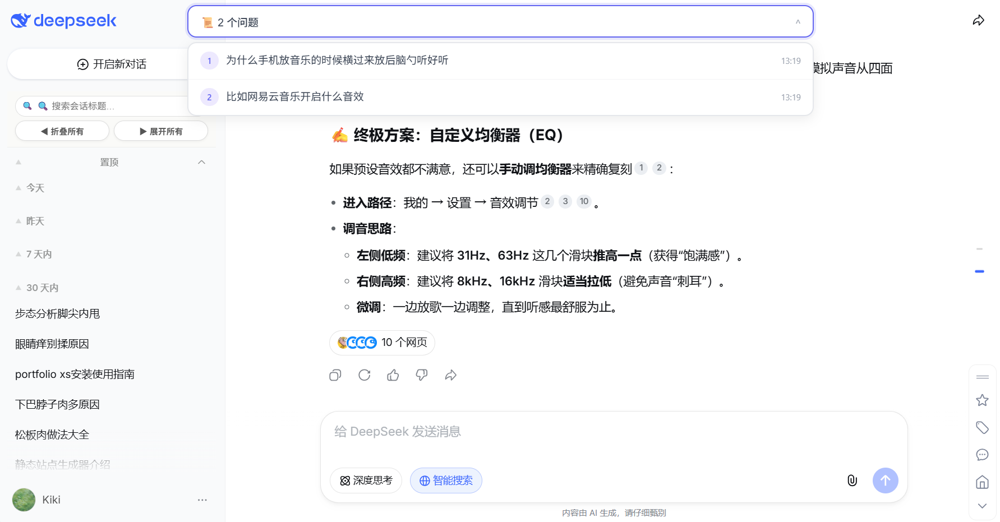

# DeepSeek 侧边栏增强插件（自用版）

> 让 DeepSeek 的侧边栏更好用：加宽标题、问题定位、时间折叠、关键词搜索。

> 这不是一个“开箱即用”的通用插件，是我给自己做的半成品工具。  
> 放出来主要是**分享思路**，如果你有类似痛点，可以参考代码自己改。

## 效果预览

插件效果：

## 当前状态

✅ 我自己每天都在用  
⚠️ 别人不一定能直接用（依赖 DeepSeek 当前页面结构，未做兼容性处理）  
🔧 后续不打算深度开发，欢迎 Fork 自己改

## 已实现功能

- 侧边栏加宽，标题显示更完整
- 顶部加了一个长条框，可以显示更全问题字数，并识别当前会话附近的问题，点击跳转
- 按原生时间分类折叠（方便看旧会话）
- 关键词搜索历史会话（基础版，只支持精确匹配）

## 已知限制

- 只在 Edge 上测试过
- 如果 DeepSeek 更新页面结构，插件可能失效
- 顶部长条框目前跳转不稳定
- 旧会话面对懒加载需要折叠多次
- 搜索功能比较简单，不是模糊匹配
- 代码仅供思路参考

## 适合谁

- 觉得 DeepSeek 原生侧边栏标题太短、看得费劲的人
- 不介意自己动手改代码的人
- 想看看别人怎么实现这些功能的人
- 想参考代码自己改着玩的人

## 不适合谁

- 想要完美开箱即用的插件
- 不想折腾、希望长期稳定的用户

## 安装方法（如果你想试）

1. 下载代码，解压
2. Edge 打开 `edge://extensions/`
3. 启用“开发人员模式”
4. 点击“加载解压缩的扩展”，选择文件夹
5. 打开 DeepSeek 网页看看效果

> 不保证一定能用，如果不行可以提 Issue，但我可能不会修。

## 免责声明

- 本插件为**个人免费开源项目**，仅供学习交流使用
- 本插件与 DeepSeek 官方**无任何关联**
- 本插件**不收集任何用户数据**，所有操作仅在本地浏览器执行
- 使用本插件产生的任何问题，作者不承担法律责任
- 插件修改了 DeepSeek 网页的界面和交互，**不保证长期兼容**
- 如果 DeepSeek 官方更新导致插件失效，请理解维护可能不及时

**请勿将本插件用于商业目的**，否则可能违反 DeepSeek 的服务条款。  
如果有人卖这个插件，那不是我的行为，请注意甄别。

## 许可证

MIT License —— 代码你可以随便改、随便用，但请保留原作者声明，且**请勿商业售卖**

## 支持一下

如果你喜欢这个插件，可以⭐ Star 支持一下～

如果思路对你有启发，可以请我喝杯咖啡 ☕️（自愿打赏）

